# Description

This project showcases how to configure a basic FastAPI service, instrument it with OpenTelemetry, and forward telemetry signals — including traces and metrics — to Grafana.


# Service architecture



The service currently consists of:
- `fastapi` / `manually_instrumented_fastapi_service`
  - I know, the name sounds stupid, so expect some renaming in the future. The main point is that this service is semi-manually instrumented. i.e. metrics and traces are configured and generated directly in the code (except for the fastapi instrumentation at the moment). So you are in the control of what and when gets emitted. This is usually a good practice in cost constrained environments where you can't afford to emit telemetry signal for every single operation (like it can happen with auto-instrumentations). This package should be fully moved to manual instrumentation in the future
  - For more information about this service, see the `manually_instrumented_fastapi_service/` python package and its readme
- `collector`
  - more info: https://opentelemetry.io/docs/collector/
  - > The OpenTelemetry Collector offers a vendor-agnostic implementation of how to receive, process and export telemetry data. It removes the need to run, operate, and maintain multiple agents/collectors.
  - In simpler terms this serves as a sink. 
    - Receives (listener) signals from multiple sources
    - processes them
    - forwards them to multiple telemetry backends
- `tempo`
  - grafana's tracing backend
  - find more info: https://grafana.com/docs/tempo/latest/
- `prometheus`
  - open-source monitoring solution, metrics backend
  - > Prometheus, a Cloud Native Computing Foundation project, is a systems and service monitoring system. It collects metrics from configured targets at given intervals, evaluates rule expressions, displays the results, and can trigger alerts when specified conditions are observed.
  - find more info: https://prometheus.io/
- `grafana`
  - > Grafana Open Source Software (OSS) enables you to query, visualize, alert on, and explore your metrics, logs, and traces wherever they’re stored. Grafana data source plugins enable you to query data sources including time series databases like Prometheus and CloudWatch, logging tools like Loki and Elasticsearch, NoSQL/SQL databases like Postgres, CI/CD tooling like GitHub, and many more. Grafana OSS provides you with tools to display that data on live dashboards with insightful graphs and visualizations.
  - find more info: https://grafana.com/docs/grafana/latest/

I would like to add multiple api services to this stack in the future:
- an api service (most probably fastapi) that leverages a combination of zero code instrumentation and manual instrumentation and showcases the usage of opentelemetry bootstrap
- an api service with graphql 


# How to run the application

## Docker compose

### Development mode

In this mode, the FastAPI service(s) are not installed into their environments, and Uvicorn (the ASGI web server) is executed in hot reload mode. The code from your host is volume-mapped into the container, so every time you edit something on your laptop, it is reflected inside the container and the API service is restarted. (This is not needed if you install editors like Vim or Helix into the container, or if you access the code through a remote development IDE.)

This mode is driven by the `docker-compose.dev.yml` file, which serves as an override for the main `docker-compose.yml` file. It overrides the following aspects:

- **Build:** Builds the Dockerfile of the service with the development target (the package itself is not installed into the Python environment, i.e., using `--no-root`, among other things).
- **Volume Mapping:** Ensures that your locally developed code is reflected in the container.
- **Command:** Currently, the container executes no running Python process (`["tail", "-f", "/dev/null"]`), so you can enter the container and manually invoke the service or explore the code interactively.


#### Build

You can build a single service (FastAPI in this case), which is useful if you need to rebuild a single container before running the stack:

```shell
docker compose -f docker-compose.yml -f docker-compose.dev.yml build fastapi
```

Or build the whole stack:
```shell
docker compose -f docker-compose.yml -f docker-compose.dev.yml up --build
```


Spin Up the Compose Stack
```shell
docker compose -f docker-compose.yml -f docker-compose.dev.yml up
```


Afterward, the stack should start up and you should see the logs from all containers:
```text
 ✔ Container fastapi_otel_prometheus_grafana_poc-grafana-1     Created                                                                                                               0.0s 
 ✔ Container fastapi_otel_prometheus_grafana_poc-prometheus-1  Created                                                                                                               0.0s 
 ✔ Container fastapi_otel_prometheus_grafana_poc-collector-1   Created                                                                                                               0.0s 
 ✔ Container fastapi_otel_prometheus_grafana_poc-init-1        Created                                                                                                               0.0s 
 ✔ Container fastapi_otel_prometheus_grafana_poc-tempo-1       Created                                                                                                               0.0s 
 ✔ Container fastapi_otel_prometheus_grafana_poc-fastapi-1     Created                                                                                                               0.0s 
Attaching to collector-1, fastapi-1, grafana-1, init-1, prometheus-1, tempo-1
grafana-1     | logger=settings t=2025-02-18T14:40:13.295341934Z level=info msg="Starting Grafana" version=11.3.1 commit=64b556c137a1d9bcacd19ccb16c4cf138c78ca40 branch=v11.3.x compiled=2025-02-18T14:40:13Z
...
```

#### Running the Service

Enter the Container (Note: The container name may be different.)
```shell
docker exec -it fastapi_otel_prometheus_grafana_poc-fastapi-1 /bin/bash
```

From inside the container, execute:
```shell
uvicorn manage:entry_point --host 0.0.0.0 --port 8000 --reload
```

This is necessary because we set the Docker command to ["tail", "-f", "/dev/null"], meaning the application doesn't start automatically with the container. This setup is useful when you want to own the shell session and debug the code with a command-line debugger (which will be shown later).


### "Production" mode
Disclaimer: This is not a real production mode, but try to imagine it is.

In this mode, the FastAPI service(s) are installed into the Python environment, and there is no hot reloading or volume mapping involved. Therefore, the code you start with remains in the container (unless you edit the code inside the container). This mode is driven by the `docker-compose.yml` file.

So in order to run the service in production mode:

**build**
you can build a single service (FastAPI in this case), which is useful if you need to rebuild a single container before running the stack.

```shell
docker compose build fastapi
```

or build the whole stack
```shell
docker compose up --build
```

**spin up the compose stack**
```shell
docker compose up
```

Afterwards it should start up and you should see the logs from all containers:
```shell
docker compose up
WARN[0000] /home/patex1987/development/fastapi_otel_prometheus_grafana_poc/docker-compose.yml: `version` is obsolete 
[+] Running 7/7
 ✔ Network fastapi_otel_prometheus_grafana_poc_monitoring      Created                                             0.1s 
 ✔ Container fastapi_otel_prometheus_grafana_poc-prometheus-1  Created                                             0.2s 
 ✔ Container fastapi_otel_prometheus_grafana_poc-collector-1   Created                                             0.2s 
 ✔ Container fastapi_otel_prometheus_grafana_poc-fastapi-1     Created                                             0.1s 
 ✔ Container fastapi_otel_prometheus_grafana_poc-init-1        Created                                             0.2s 
 ✔ Container fastapi_otel_prometheus_grafana_poc-grafana-1     Created                                             0.2s 
 ✔ Container fastapi_otel_prometheus_grafana_poc-tempo-1       Created                                             0.1s 
Attaching to collector-1, fastapi-1, grafana-1, init-1, prometheus-1, tempo-1
grafana-1     | logger=settings t=2025-02-25T06:29:39.159871505Z level=info msg="Starting Grafana" version=11.5.2 commit=598e0338d5374d6bc404b02a58094132c5eeceb8 branch=HEAD compiled=2025-02-25T06:29:39Z
...
fastapi-1     | WARNING:  ASGI app factory detected. Using it, but please consider setting the --factory flag explicitly.
fastapi-1     | INFO:     Started server process [1]
fastapi-1     | INFO:     Waiting for application startup.
fastapi-1     | INFO:     Application startup complete.
fastapi-1     | INFO:     Uvicorn running on http://0.0.0.0:8000 (Press CTRL+C to quit)
```

As you can see this time the fastapi service started together with the stack


## Kubernetes
There are some plans to wrap the service into a local kubernetes cluster (minikube or k3), however this might grow into a separate repository.
This can be a useful setup to demonstrate how to debug python code in a cluster

# Testing
By default, the `manually_instrumented_fastapi_service`s port is forwarded to port 8000. So you can call the various endpoints of the service
using curl or any other tool suited for the job (postman, programatically, ...)

## Manual testing

use curl, postman, hurl, or any other tool to call the endpoints:

```shell
curl -X POST -H "Content-Type: application/json"  -d "{}" http://127.0.0.1:8000/api/v1/throttle/run
```

```shell
curl -X GET http://127.0.0.1:8000/api/v1/dummy/
```

```shell
curl -X GET http://127.0.0.1:8000/api/v1/dummy/slow\?something\=10
```

## Unit tests
TBD - we don't have unit tests yet, but we should have them :)

## Integration testing
TBD - we don't have integration tests yet, but we should have them :)

# Debugging
TBD


# FAQ

## Why is this a monorepo?
This package serves as a demonstration of telemetry collection, combining FastAPI with the Grafana stack in one convenient package.
In the future, I may deliver a decoupled solution in separate github repositories. 
But if you want to play around with the current solution, the FastAPI service can be easily configured to send telemetry to an external grafana stack

## Why do you need an opentelemetry collector for such a small project?
TBD
