# Description

This project showcases how to configure a basic FastAPI service, instrument it with OpenTelemetry, and forward telemetry signals — including traces and metrics — to Grafana.

# Service architecture

The service currently consists of:
- `fastapi` / `manually_instrumented_fastapi_service`
  - I know, the name sounds stupid, so expect some renaming in the future. The main point is that this service is semi-manually instrumented. i.e. metrics and traces are configured and generated directly in the code (except for the fastapi instrumentation at the moment). So you are in the control of what and when gets emitted. This is usually a good practice in cost constrained environments where you can't afford to emit telemetry signal for every single operation (like it can happen with auto-instrumentations). This package should be fully moved to manual instrumentation in the future
  - For more information about this service, see the `manually_instrumented_fastapi_service/` python package and its readme
- `collector`
  - more info: https://opentelemetry.io/docs/collector/
  - > The OpenTelemetry Collector offers a vendor-agnostic implementation of how to receive, process and export telemetry data. It removes the need to run, operate, and maintain multiple agents/collectors.
  - In simpler terms this serves as a sink. 
    - Receives (listener) signals from multiple sources
    - processes them
    - forwards them to multiple telemetry backends
- `tempo`
  - grafana's tracing backend
  - find more info: https://grafana.com/docs/tempo/latest/
- `prometheus`
  - open-source monitoring solution, metrics backend
  - > Prometheus, a Cloud Native Computing Foundation⁠ project, is a systems and service monitoring system. It collects metrics from configured targets at given intervals, evaluates rule expressions, displays the results, and can trigger alerts when specified conditions are observed.
  - find more info: https://prometheus.io/
- `grafana`
  - > Grafana Open Source Software (OSS) enables you to query, visualize, alert on, and explore your metrics, logs, and traces wherever they’re stored. Grafana data source plugins enable you to query data sources including time series databases like Prometheus and CloudWatch, logging tools like Loki and Elasticsearch, NoSQL/SQL databases like Postgres, CI/CD tooling like GitHub, and many more. Grafana OSS provides you with tools to display that data on live dashboards with insightful graphs and visualizations.
  - find more info: https://grafana.com/docs/grafana/latest/

I would like to add multiple api services to this stack in the future:

# How to run the application

## Development mode

## "Production" mode

## Kubernetes
TBD

# FAQ

## Why is this a monorepo?
This package serves as a demonstration of telemetry collection, combining FastAPI with the Grafana stack in one convenient package.
In the future, I may deliver a decoupled solution in separate github repositories. 
But if you want to play around with the current solution, the FastAPI service can be easily configured to send telemetry to an external grafana stack

## Why do you need an opentelemetry collector for such a small project?
